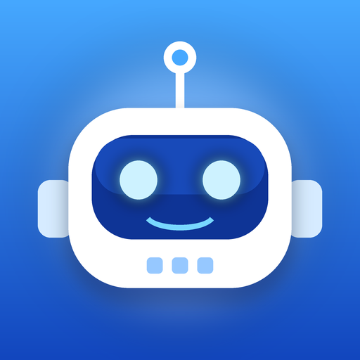

# BOT

A talk-to-me voice assistant with a blue-and-white robot face. You speak, BOT answers out loud in a natural
American female voice, and it **remembers key facts about you** so conversations get more personal over time.



## How it works

| Part | What it uses | Cost |
|------|--------------|------|
| **BOT's voice** | Apple's on-device speech synthesizer. Picks the best installed American female voice (Premium > Enhanced > Standard), e.g. Ava or Samantha. | Free, offline |
| **Your voice (input)** | Apple Speech framework, forced **on-device** when the iPhone supports it. | Free, private |
| **The brain (fast model)** | Default: **Apple's on-device language model** (Apple Intelligence, `FoundationModels`). Replies stream sentence-by-sentence, so BOT starts talking after the first sentence. Optional: **Claude Haiku 4.5** (Anthropic's fastest model) if you paste an API key. | On-device: free. Haiku: billed by Anthropic, opt-in only |
| **Memory** | A local JSON file (`Application Support/BOT/facts.json`). Nothing leaves the phone except, if you opt into Claude, the text of the conversation. | Free |

The voice never uses a paid API.

### Requirements for the on-device brain
iPhone 15 Pro / 16 or newer, iOS 26+, Apple Intelligence turned on. If your iPhone doesn't qualify, BOT says so on
the main screen and falls back to **Claude Haiku** (if you add a key in Settings) or **Basic mode** (a small rule-based
responder that can still learn facts about you, but isn't a real conversationalist).

### Getting a better voice (recommended, one minute)
iOS Settings → Accessibility → Spoken Content → Voices → English → **English (United States)** → download **Ava (Premium)**
or **Samantha (Enhanced)**. BOT picks the best one automatically, or choose in BOT → Customize → Voice.

## Using it
- **Tap the robot or the mic button** to start. BOT greets you, then listens; it replies when you pause.
- **Hands-free** (ear icon, on by default): it keeps listening after each reply. Turn off for push-to-talk.
- Tap while BOT is talking to **interrupt**. Tap the **X** to end the conversation.
- Say **"remember that …"**, **"forget that …"**, or **"forget everything about me"**.
- The brain icon shows (and lets you edit, pin, delete, add) everything BOT knows. A "Learned: …" badge pops up when it picks up something new.

## Live info: weather and web search
- **Weather**: Open-Meteo (free, no key) + your location, or "weather in Chicago".
- **Web search**: with a Claude key, Claude searches the live web itself (Anthropic's web search tool; small per-search fee). Otherwise BOT searches DuckDuckGo (free, no key), falls back to Wikipedia, and reads the top pages. An optional Brave Search key (Settings → Search) makes the no-Claude path more reliable. Toggle in Settings → Search.

## Reminders and timers
Say "remind me to call Mom at 5", "remind me tomorrow at 9 to take my pills", or "set a timer for 10 minutes". BOT shows a banner notification and speaks the reminder: live if the app is open, otherwise the notification plays a recording of BOT's own voice (rendered on-device when the reminder is set). The bell icon lists and deletes them; you can also say "what are my reminders" or "clear my reminders". Works with every brain, even Basic mode.

## More things BOT does
- **Daily briefing**: say "good morning" or "brief me", or set a daily alarm in Customize. BOT reads the weather, your meetings, today's reminders and the top 3 NPR headlines.
- **Leave-now alerts**: for meetings with an address, BOT estimates the drive (Apple Maps) and alerts you when it's time to go.
- **Repeating reminders and snooze**: "remind me every weekday at 8 to take my pills", "snooze for 10 minutes".
- **Lists and notes**: "add milk and eggs to my grocery list", "what's on my to-do list", "take a note: call the plumber", "what did I note about the plumber".
- **Call, text, directions, nearby**: "call Mom", "text Sam I'm running late" (opens Messages pre-filled; you tap Send), "directions to the airport", "find a coffee shop near me". iOS asks you to confirm calls.
- **Camera**: "what is this?" opens the camera; tap the shutter and Claude describes it (needs a Claude key).
- **History**: chats are remembered for 30 days. "What did we talk about yesterday?"
- **Translator**: "how do you say where is the bathroom in Spanish" (AI brain), spoken in a native voice.
- **Conversions**: "convert 5 miles to kilometers", "how much is 100 dollars in euros" (live rates, free).

## Email (iCloud, Yahoo, Gmail, work IMAP)
Customize → **Email accounts** → add an account with an app-specific password. Then: "do I have any new email?", "read my unread emails", "read emails from Dana", "reply that Thursday works", "email Sam that I'll be late". BOT reads each draft back and only sends after you say "send it". It connects straight to your mail provider (IMAP/SMTP) and uses `EXAMINE`/`BODY.PEEK`, so it never marks mail as read. **Privacy:** email text is never sent to Claude or any search service. Summaries and drafting use Apple's on-device AI when available, otherwise BOT reads the subject and first line; email turns are excluded from the history sent to Claude. Outlook/Microsoft 365 needs OAuth and isn't supported yet.

## Calendar
Turn on **Customize → Calendar → Meeting alerts** (iOS asks for calendar access). BOT then schedules a banner plus a spoken heads-up ("Heads up. Team sync starts in 10 minutes.") for each meeting in the next 3 days, refreshed whenever you open the app or your calendar changes. Ask "What's on my calendar today?", "…tomorrow?", "…this week?" or "When's my next meeting?" by voice. Read-only: BOT never edits your calendar. The on-device AI sees your next two days; Claude only if you enable "Let Claude see my schedule".

## Waking BOT by voice
Say **"Hey Siri, talk to BOT"** (also "wake up BOT", "ask BOT"). BOT opens, says "Yes?", and listens. It uses an App Intent, so there's no always-on microphone and no battery cost. It also appears in the Shortcuts app, where it can be bound to the Action Button or Back Tap. Say "goodbye" to end a conversation.

## Design options (slider icon, top left)
Live preview with idle / listening / thinking / speaking states, and:
- **Quick looks**: Classic, Midnight, Frost, Neon, Studio
- **Accent color** (6 blues), **appearance** (system / light / dark), **background** (solid, gradient, grid, glow), **text font** (rounded, standard, serif, mono)
- **Robot**: style (classic, inverted, outline), eyes (round, square, pill), mouth (equalizer, smile), size, animation intensity, haptics
- **Captions**: on/off and text size
- **Voice**: voice picker with preview, speed, pitch
- **Conversation**: bot name, hands-free, pause-before-reply, reply length, personality (warm, upbeat, calm, witty)
- **Brain** and **Memory** controls

## Build

### Option A — you have a Mac
```bash
brew install xcodegen
xcodegen generate
open BOT.xcodeproj
```
Needs Xcode 26 for the Apple on-device brain (the code still builds on older Xcode; that brain just drops out).

### Option B — no Mac (cloud build + sideload)
1. Push this folder to a GitHub repo (branch `main`). `.github/workflows/build-ipa.yml` builds an **unsigned**
   `BOT-unsigned.ipa` on GitHub's `macos-26` runner (artifact `BOT-unsigned-ipa`).
2. Download the artifact from the Actions run.
3. Sideload with **AltServer for Windows** (altstore.io) over USB using your own Apple ID. Free-account installs
   expire after 7 days and need re-signing.

Regenerate the app icon with `python scripts/gen_icon.py` (needs Pillow).

## Layout
```
Sources/
  BOTApp.swift                  entry point
  Conversation/ConversationEngine.swift   listen → think → speak loop, memory commands, fact learning
  Brain/                        Brain protocol, AppleBrain (on-device), ClaudeBrain (optional), BasicBrain (fallback)
  Voice/Speaker.swift           free on-device TTS, voice picker, sentence chunker, markdown/emoji stripping
  Voice/Listener.swift          on-device speech recognition with silence detection + mic level
  Memory/FactStore.swift        local fact database (dedupe, pin, forget)
  Memory/FactExtractor.swift    instant regex rules + AI-based extraction prompt/parse
  Settings/                     Preferences (all design options), Theme, Keychain (optional Claude key)
  UI/                           RobotView, ContentView, SettingsView, MemoryView, TranscriptView, BackgroundView
```
